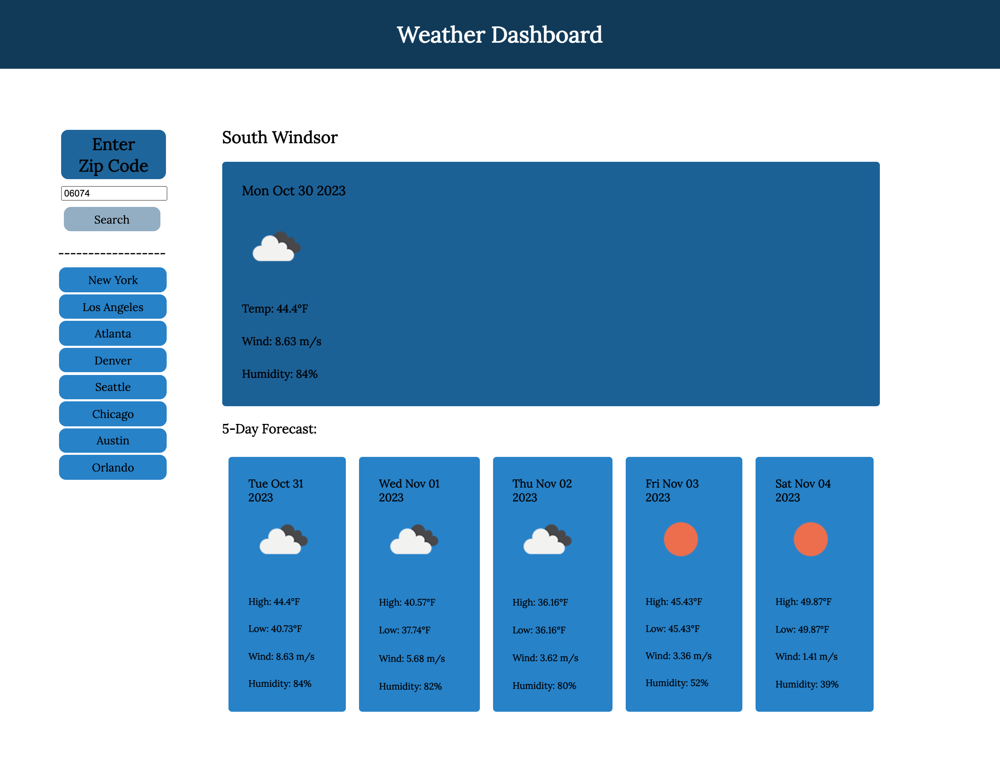

# Weather Dashboard
## Description

<link><a href="https://samanthashleyrose.github.io/Weather-Dashboard/">The Weather Dashboard Site</a></link> uses  HTML, CSS, and JS in conjunction with OpenWeather's API Documention. The user can simply enter a zip code or select from the list of Popular Cities and noe the current weather information will populate as well as the 5-day forecast.

OpenWeather's API was extremely useful during this project. By gathering the needed data in JavaScript, the site is able to display:
- The city name
- The date
- The temperatue (current/high/low)
- The wind speed
- The humidity levels

## Table of Contents

- [Installation](#installation)
- [Usage](#usage)
- [Credits](#credits)
- [License](#license)

## Installation

No installation necessary!

## Usage

Start by entering a zip code into the input box located in the search panel. Today's current weather will populate as well as a 5-day Forecast. Use the Quick Search Buttons located under the search panel to get the weather information for popular cities. 

## Credits

#### Knowledge Assitance From:
<li>Lee Warrick <link><a href="https://leewarrick.com/">Personal Portfolio</a></link></li>
<li>Mia Ciasullo <link><a href="https://github.com/miacias">GitHub Portfolio</a></link></li>

#### Technologies Used:
<li><link><a href="https://chat.openai.com/">ChatGPT</a></link></li>
<li><link><a href="https://fonts.google.com/specimen/Merriweather?preview.text=Work%20Day%20Scheduler">Google Fonts</a></link></li>

#### Documentation Used:

<li><link><a href="https://www.zipdatamaps.com/index.php">ZipDataMaps</a></link></li>
<li><link><a href="https://openweathermap.org/api">OpenWeather API</a></link></li>
<li><link><a href="https://www.w3schools.com/js/js_loop_for.asp">W3schools JavaScript For Loop</a></link></li>
<li><link><a href="https://www.w3schools.com/js/js_dates.asp">W3schools JavaScript Date Objects</a></link></li>

## License

Please refer to the MIT LICENSE in the repo.
